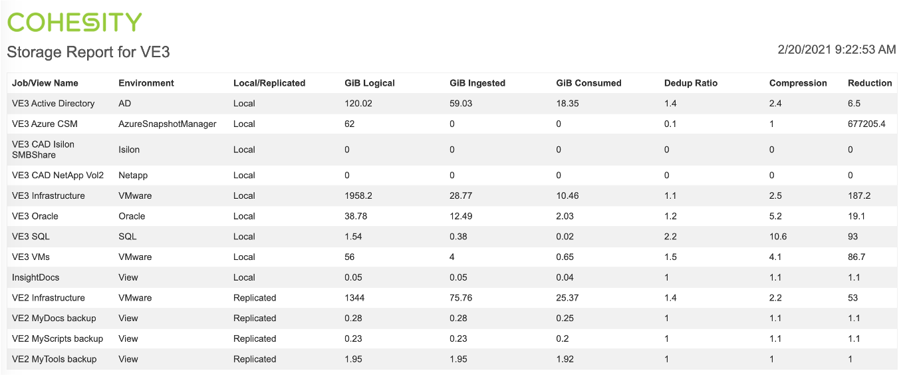
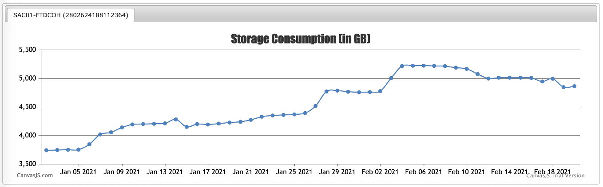
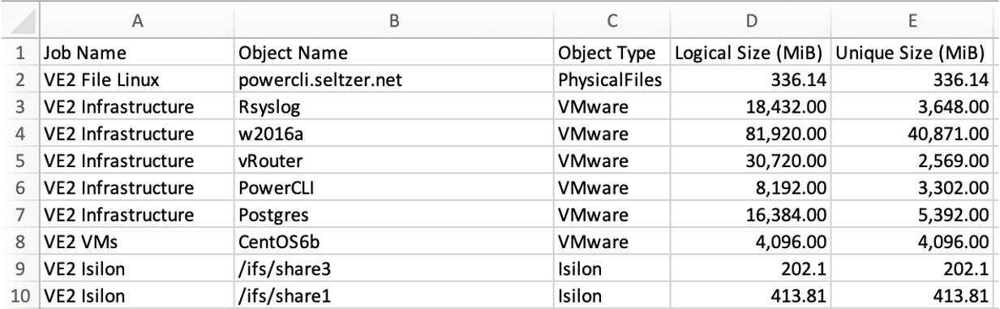
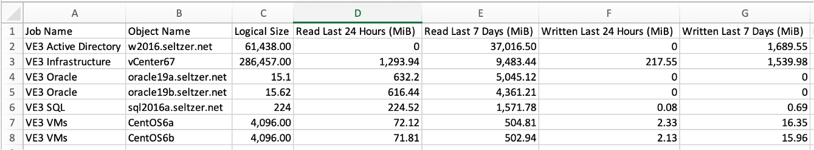
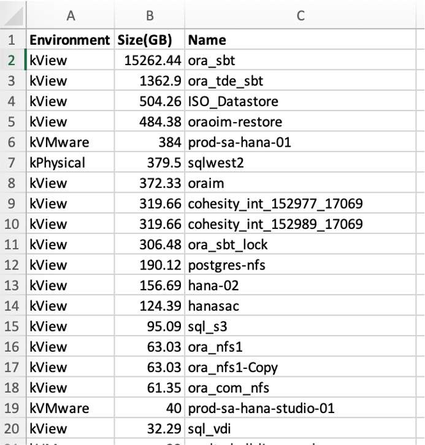
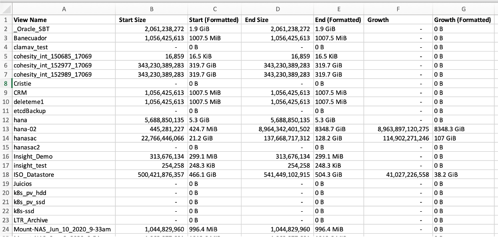
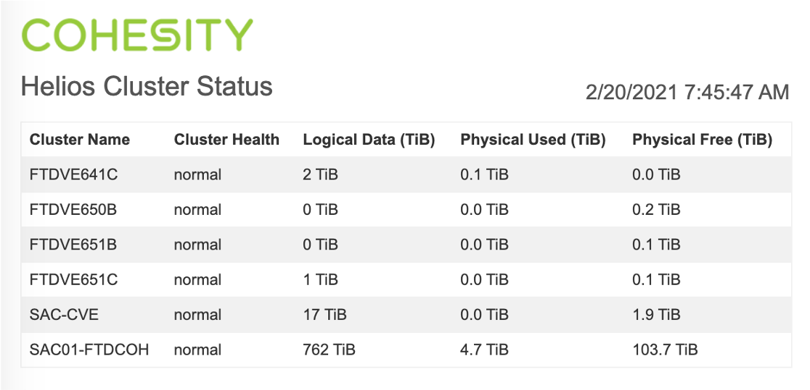
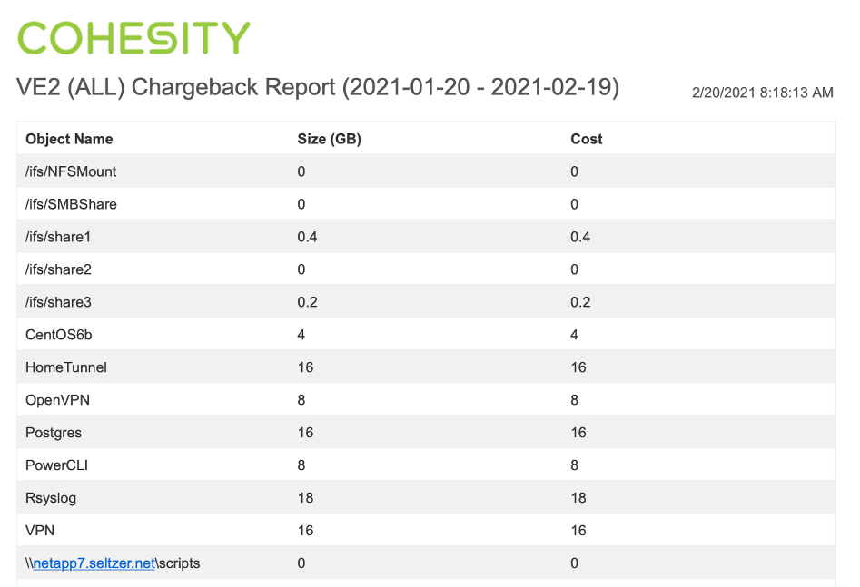
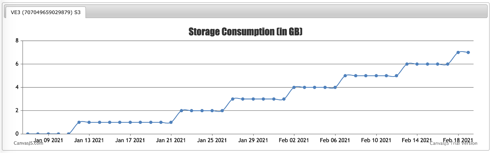

# Capacity Reports

Here are some sample reports available to help analyze and monitor storage consumption on Cohesity clusters.

## Storage Report

<https://github.com/bseltz-cohesity/scripts/tree/master/powershell/storageReport>

This script generates HTML and CSV showing storage per job and per view

## Storage Chart

<https://github.com/bseltz-cohesity/scripts/tree/master/powershell/storageChart>

This script generates HTML showing cluster storage consumption over time.

## Front-end Capacity Report

<https://github.com/bseltz-cohesity/scripts/tree/master/powershell/frontEndCapacityReport>

This script generates CSV output showing the front-end size of protected objects.

## Data Per Object

<https://github.com/bseltz-cohesity/scripts/tree/master/powershell/dataPerObject>

This script generates CSV output showing the logical size and data read/written over the past X days.

## Logical Usage

<https://github.com/bseltz-cohesity/scripts/tree/master/capacityTools/logicalUsage>

This script generates a CSV file containing protected objects and views, sorted by logical size. The report provides insight into which objects contribute the most potential storage consumption.

## View Growth

<https://github.com/bseltz-cohesity/scripts/tree/master/capacityTools/viewGrowth>

This script generates a CSV file containing views and their logical size over a range of X days, showing which are growing over time.

## Helios Cluster Status

<https://github.com/bseltz-cohesity/scripts/tree/master/helios/powershell/heliosClusterStatus>

This script generates HTML output with cluster health and storage stats for clusters connected to Helios.

## Chargeback Report

<https://github.com/bseltz-cohesity/scripts/tree/master/powershell/chargebackReport>

This script generates HTML output showing the logical size of protected objects and an associated cost (note this is logical, not accurate post-dedup consumption).

## External Target Storage Chart

<https://github.com/bseltz-cohesity/scripts/tree/master/powershell/externalTargetStorageChart>

This script generates HTML output showing storage consumption of an external target over time.

