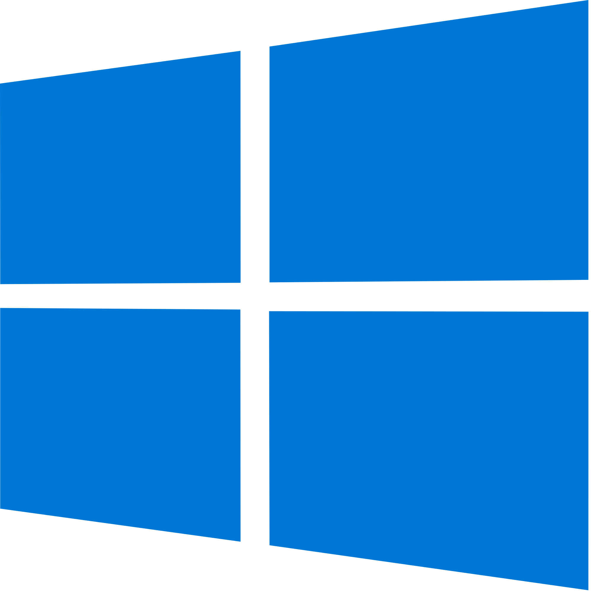
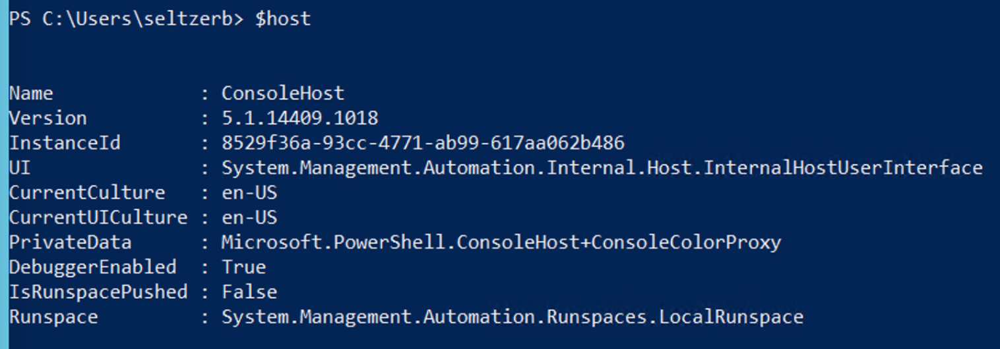
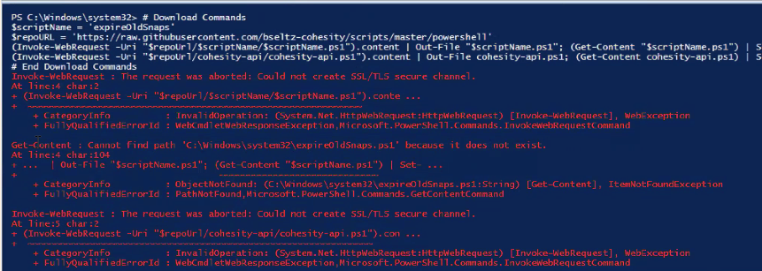

# Running These PowerShell Scripts

## Where to Run These Scripts

No, these scripts can not be run on the Cohesity cluster. PowerShell is not installed there, and we don't go around installing things on the cluster. You can run the script from almost anywhere else where PowerShell 5.1 or later is installed, including your  Macbook, a common  Linux distro, a  Windows server, you name it. The only requirement is that the script can reach the Cohesity cluster over the network via port 443/tcp.

## Check Your PowerShell Version

First, let's make sure your PowerShell version is adequate. Open a PowerShell window and type:

`$host`



The minimum required version is `5.1`. Older versions of Windows (like Server 2012 R2) came with PowerShell 4.0, which won't work. Older PowerShell versions can't connect to Cohesity because they didn't have support for modern HTTPS encryption standard TLSv1.2 which is required by Cohesity (and pretty much everyone else these days).

You can search Microsoft to find a patch bundle appropriate to your Windows version, to upgrade to PowerShell 5.1 (which often requires a reboot), or you can install PowerShell Core (no reboot required) for Windows, MacOS, and various Linux distributions here: <https://github.com/PowerShell/PowerShell#get-powershell>

Please install the LTS or stable version (the preview version is often problematic).

## Are You Allowed to Run Scripts?

Often, the customer's PowerShell is locked down by default. The script execution policy is by default set to a restrictive setting such as `Restricted` or `RemoteSigned`. Attempts to run scripts downloaded from GitHub will fail. To check the current execution policy, type the following in PowerShell:

```powershell
Get-ExecutionPolicy
```

To adjust the policy, set the policy to something less restrictive, like Unrestricted or Bypass:

```powershell
Set-ExecutionPolicy Unrestricted
```

Depending on your level of access on host, you may have to run the above command with PowerShell started as Administrator, or you may be able to apply the setting for just your current user, like so:

```powershell
Set-ExecutionPolicy Unrestricted -Scope CurrentUser
```

There may be other restrictions being applied via Active Directory Group Policy, which we may not be able to bypass. In this case, you must contact your Active Directory administrators to create an exception to allow scripts to run.

## Dependencies

There are no additional requirements to run the PowerShell scripts in this repository (you do `not` need to install the Cohesity PowerShell Module). These scripts use a function library called `cohesity-api.ps1` which is downloaded with the script if you follow the download instructions included in the README for each script.

## Opening a PowerShell Window

Just a quick note: no, you don't need to run PowerShell as administrator. If you do launch PowerShell as administrator, the default current directory will be `C:\Windows\System32` which is `not` a good place to start downloading scripts. Please change directory and make a folder for your scripts (perhaps `c:\scripts`), like:

```powershell
c:
cd \
md scripts
cd scripts
```

## Downloading a Script

Each script has a README which includes instructions to download the script, which are PowerShell commands that you can paste into a PowerShell window to pull down the files. For example:

```powershell
# Download Commands
$scriptName = 'backupNow'
$repoURL = 'https://raw.githubusercontent.com/cohesity/community-automation-samples/main/powershell'
(Invoke-WebRequest -UseBasicParsing -Uri "$repoUrl/$scriptName/$scriptName.ps1").content | Out-File "$scriptName.ps1"; (Get-Content "$scriptName.ps1") | Set-Content "$scriptName.ps1"
(Invoke-WebRequest -UseBasicParsing -Uri "$repoUrl/cohesity-api/cohesity-api.ps1").content | Out-File cohesity-api.ps1; (Get-Content cohesity-api.ps1) | Set-Content cohesity-api.ps1
# End Download Commands
```

**Note**: if you find an old script that doesn't have download commands in the README, please open an issue or report it to BSeltz...

Paste the download commands into the PowerShell window (after first changing to a directory where you want the scripts to be placed). Note that PowerShell on Windows doesn't support ctrl-c/ctrl-v, you must right-click to paste, and may have to hit return to execute the final command.

If you don't follow the download instructions (if for example you clone the github repo to your machine), the files may end up having the incorrect line endings for your operating system, which will cause mysterious errors when you try to run the script.

When you paste the download commands you may receive errors that look like this:



The error indicates that PowerShell doesn't trust the SSL certificate on GitHub's web site (goodness knows why). If you see this error, paste the following commands into PowerShell.

```powershell
# commands to fix SSL
[Net.ServicePointManager]::SecurityProtocol = [Net.SecurityProtocolType]::Tls12
[System.Net.ServicePointManager]::ServerCertificateValidationCallback = { return $true }
$ignoreCerts = @"
public class SSLHandler
{
public static System.Net.Security.RemoteCertificateValidationCallback GetSSLHandler()
{
    return new System.Net.Security.RemoteCertificateValidationCallback((sender, certificate, chain, policyErrors) => { return true; });
}
}
"@

if(!("SSLHandler" -as [type])){
    Add-Type -TypeDefinition $ignoreCerts
}
[System.Net.ServicePointManager]::ServerCertificateValidationCallback = [SSLHandler]::GetSSLHandler()
# end ssl commands
```

After pasting these commands, try pasting the download commands again.

## If the Download Commands Just Don't Work

If the scripts still fail to download, keep in mind that the machine may simply not have access to GitHub (due to lack of firewall access). Alternatively you can copy and paste the script code manually. To do this, click on the script file and click the `Raw` button to display ths script code in clear text. You can then select all, copy, and paste the code into a new file on the machine. You will also need a copy the the `cohesity-api.ps1` file located here: <https://github.com/cohesity/community-automation-samples/tree/main/powershell/cohesity-api>

## Connecting to Cohesity Clusters over Support Channel (RT)

Most of the scripts have a `-vip` parameter which is the Cohesity cluster to connect to. When connecting to a cluster directly over the network or VPN, you can use an IP Address or DNS name (assuming you can resolve it). If you are connecting to a Cluster over RT, then the `-vip` should be the same address that the browser uses (e.g. `localhost:59083`).

## Usernames, Domains, and Passwords

Scripts also have `-username` and `-domain` parameters, and the format is the same as it is in the UI logon screen. For example, to log on as local admin, it's:

`-username admin -domain local`

Actually, `-domain` defaults to local, so you can omit the `-domain` parameter entirely if you're using a local account. For Active Directory accounts, the `-domain` should match what you see in the domain list in the UI logon screen (which is the FQDN of the Active Directory domain), like:

`-username myuser -domain mydomain.net`

Note that `-username myuser -domain mydomain` will `not` work. The domain name is `mydomain.net` not `mydomain`.

Older scripts did `not` have a `-password` parameter. The goal was to avoid typing the password in clear text on the command line, or worse, saving the password in a clear text file. Instead, when you first run a script using a specific VIP/user/domain, you will be prompted for the password, and the password will be stored, encrypted, for later use. The next time you use the same VIP/user/domain for `any` script, the stored password will be used automatically.

## Multi-factor Authentication (MFA)

In recent Cohesity versions, it has become mandatory to enable multi-factor authentication (MFA) for Active Directory users added to Cohesity. This is to guard against hacked AD accounts being used in a cyber attack. When authenticating through the Cohesity REST API, if MFA is enabled, the MFA OTP code must be sent with the authentication request, or authentication will fail.

In the current release of the script libraries (cohesity-api.ps1 and pyhesity.py), if the required MFA code is omitted, an error will be reported: "Authentication failed: MFA Code Required". In older versions, a less helpful error message was reported: "Please specify the mandatory parameters". In this case, you must use the -mfaCode paramter of the script, for example:

```powershell
.\backupNow.ps1 -vip mycluster `
                -username myuser `
                -jobName myjob `
                -mfaCode 123456
```

Most scripts released recently have this -mfaCode parameter. If you find an older script where the -mfaCode parameters is not present, please ask to have the script updated.

Since the MFA code changes frequently, it can not be used for scheduled/unattended script execution. In this case, we can avoid MFA by using API Key authentication.

## API Key Authentication

In recent versions of Cohesity, multi-factor authentication (MFA) has become highly recommended and in some cases mandatory. This makes it impossible to schedule scripts to run unattended. In this case, we can avoid MFA by using API Key authentication.

You can create an API Key by navigating to  Settings -> Access Management -> API Keys but prior to Cohesity 7.0, by default, the API Key management page was not visible in the Cohesity UI until you set a UI feature flag.

### Temporarily Enable the API Keys Page

Note: this change will only remain in effect for your current browser session

1. Log into the Cohesity UI (directly to the cluster, not via Helios)
2. In the address bar, enter the url: <https://mycluster/feature-flags>
3. In the field provided, type: api
4. Turn on the toggle for apiKeysEnabled

Now you can navigate to Settings -> Access Management -> API Keys

### Permanently Enable the API Keys Page

To make the API Key management page visible permanently, ask Cohesity support to help you set the iris gflag:

```bash
iris_ui_flags: apiKeysEnabled=true
# note: iris must be stopped and started for the changes to take effect
```

### Create an API Key

Now that the API Key management page is visible, to create yourself an API key:

1. Go to Settings -> Access Management -> API Keys
2. Click Add API Key
3. Select the user to associate the new API key
4. Enter an arbitrary name
5. Click Add

You will have one chance to copy or download the new API key (it will not be visible again once you navigate away from the page).

### Using an API Key for Authentication

When using an API key, there is no need to acquire an access token nor session ID. You simply add a header to your requests:

```bash
apiKey: xxxxxxxx-xxxx-xxxx-xxxx-xxxxxxxxxxxx
```

With this header set, you can make API calls without any further authentication. An example curl command:

```bash
curl -X GET "https://mycluster/irisservices/api/v1/public/cluster" \
     -H "apiKey: xxxxxxxx-xxxx-xxxx-xxxx-xxxxxxxxxxxx" \
     -H "accept: application/json"
```

### Using an API Key in BSeltz Scripts

Most BSeltz scripts released in the past several years have a -useApiKey parameter, for example:

```powershell
.\backupNow.ps1 -vip mycluster `
                -username myuser `
                -jobName myjob `
                -useApiKey
```

This tells the script that the password given is an API key (it will be placed in the headers as mentioned above)

When prompted for a password (or specifying the password on the command line), enter the API key instead of a password.

```powershell
.\backupNow.ps1 -vip mycluster `
                -username myuser `
                -jobName myjob `
                -useApiKey `
                -password xxxxxxxx-xxxx-xxxx-xxxx-xxxxxxxxxxxx
```

## Reporting Problems

If you have a complaint about a script, please try getting the latest version of the script, here: <https://github.com/cohesity/community-automation-samples?search=1>

Before reporting the issue, please collect:

* The name of the script (e.g. backupNow.ps1)
* The complete command line the customer is using
* The complete output emitted when the script ran
* Screenshots of the Cohesity UI that prove the script should have worked (protection sources, protection groups, etc. that match what was entered on the command line)
