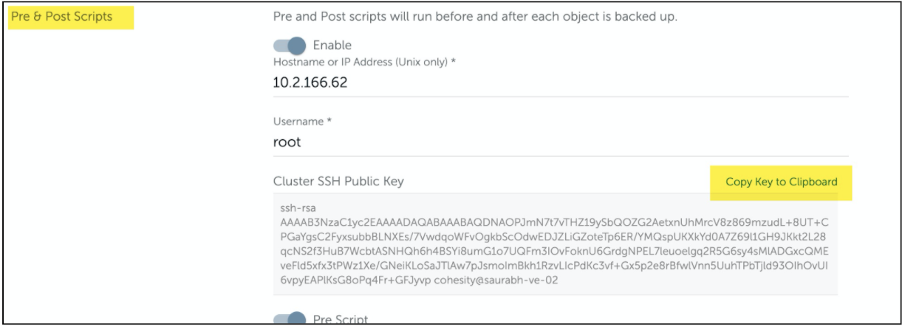
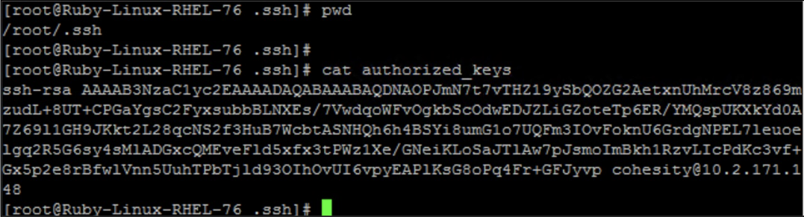
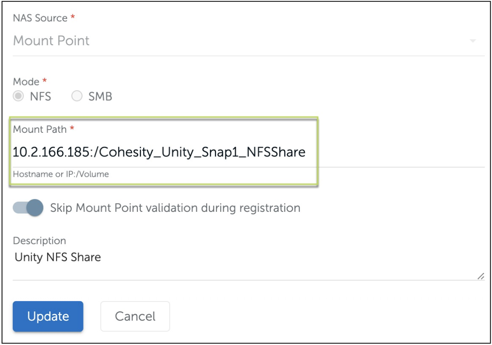
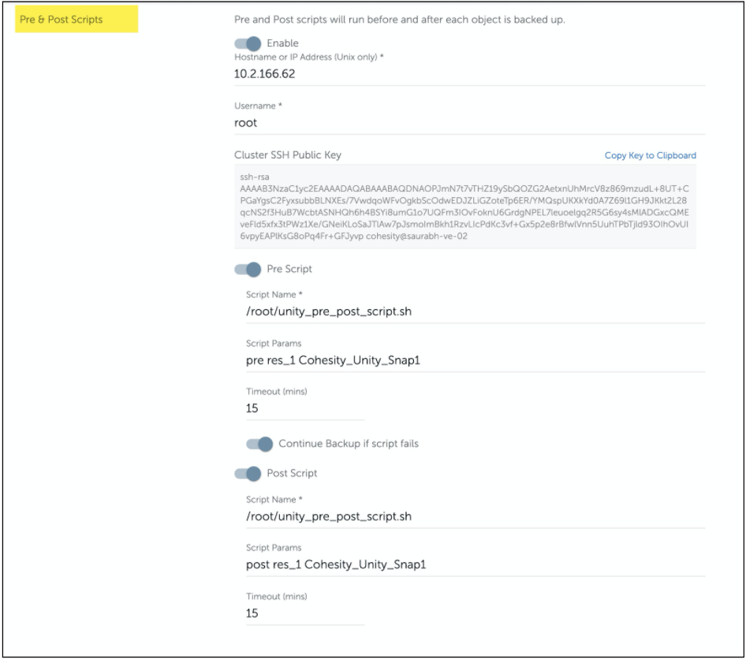

# Protect Dell EMC Unity with Cohesity Generic NAS Pre & Post Script

Warning: this code is provided on a best effort basis and is not in any way officially supported or sanctioned by Cohesity. The code is intentionally kept simple to retain value as example code. The code in this repository is provided as-is and the author accepts no liability for damages resulting from its use.

Cohesity custom pre & post script for DELL EMC Unity will allow you to configure snapshot based
backup. This Script gives the capability to run the custom scripts on the Protected NAS
before and/or after the Protection Group runs.

## Prerequisites

Below is the list of prerequisites which should meet before configuring the Protection Group:

* Unisphere CLI installation is required on Unix/Linux Host which would be hosting the Pre/Post Script to run the uemcli commands to the Unity target

* Download the rpm from [here](https://download.emc.com/downloads/DL69827_Dell-EMC-Unity-Unisphere-UEM-CLI-(SuSE-Linux-64-bit).rpm) and WinSCP it to UNIX/Linux Host

* Run `yum localinstall <file_name>.rpm`

* Test `which uemcli`

`Note`: Script is Tested with UnisphereCLI-SUSE-Linux-64-x86-en_US-5.0.3.984728-1.x86_64.rpm

Run below commands on the Unix/Linux Host: This will save Unity's Management IP address, username, and password on the localhost and would not expose these via script.

```bash
uemcli -d <Unity Management IP Address> -u <username> -default
uemcli -d <Unity Management IP Address> -u <username> -p <Password> -saveUser

#Example
uemcli -d 10.2.166.184 -u admin -default
uemcli -d 10.2.166.184 -u admin -p Password123 -saveUser
```

Configure RSA authentication on the UNIX/Linux Host to authenticate Cohesity

* Login to Cohesity DataPlatform UI

* Navigate to Protection Group’s (the one created for Unity’s data protection) Advanced Settings

* Edit the Pre & Post Scripts

* Click **Copy Key to Clipboard** to copy the “Cluster SSH Public Key.”

 

* Login to UNIX/Linux host

* Open the authorized_keys file (typically located in the ~/.ssh directory) and paste the entire string to the end of the file

* Ensure authorized_keys permissions are set to 755

* If the Cohesity hostname is not reachable from Unix/Linux host, then replace the hostname with an IP address.

 

Registering a Source, register the Unity’s filesystem share path to backup. To register a source,

* Navigate to Data Protection > Sources

* Click “Register Source” (+) and choose NAS

* Select NAS Source as “Mount Point.”

* Select Mode as NFS or SMB

* In the Mount Path: Specify the NFS/SMB volume snapshot share path that needs to be backed up.

```text
 Share Path format: <Unity Management IP>:/Cohesity_Unity_Snap_<NFS/CIFS>Share

 For Example - 

 For NFS Mode:
 Share Path: 10.2.166.185:/Cohesity_Unity_Snap_NFSShare

 where, 
 10.2.166.185 - Unity Data IP
 /Cohesity_Unity_Snap_NFSShare - Path of the NFS snapshot share, which will be created by the script

 For CIFS Mode:
 Share Path: 10.2.166.185\Cohesity_Unity_Snap_CIFSShare 
 
 where, 
 10.2.166.185 - Unity Data IP
 /Cohesity_Unity_Snap_CIFSShare - Path of the CIFS snapshot share, which will be created by the script
```

* Toggle on “Skip Mount Point validation during registration.”

 

Configuring Protection Group

* Enter the mandatory values to configure a Protection Group ( Protection Group name, Source, Storage Domain, Policy, etc.).

* Under the Advanced Section Toggle on to **Enable Pre & Post Script**. Below, Screenshot captures the necessary details to configure Pre & Post Script.

 

Field Name | Value | Notes
--- | --- | ---
Hostname or IP Address | Linux/UNIX Hostname or IP Address | Linux/Unix Hostname where Pre & Post Script is hosted
Username | Linux/UNIX username | Linux/Unix username which would run the script on the UNIX host
Pre Script > Script Name | The absolute path of the Pre Script | The absolute path of the Pre Script hosted on Linux/Unix server
Script Params | pre <Unity_Filesystem_CLI_ID> Cohesity_Unity_Snap | 1. Take Filesystem CLI ID from Unisphere <br> 2. Cohesity_Unity_Snap is the snapshot name that will be created by the prescript
Post Script> Script Name | The absolute path of the Post Script | The absolute path of the Post Script hosted on Linux/Unix server
Script Params | post <Unity_Filesystem_CLI_ID> Cohesity_Unity_Snap | 1. Take Filesystem CLI ID from Unisphere <br> 2. Cohesity_Unity_Snap is the snapshot name that will be deleted by the Post Script
