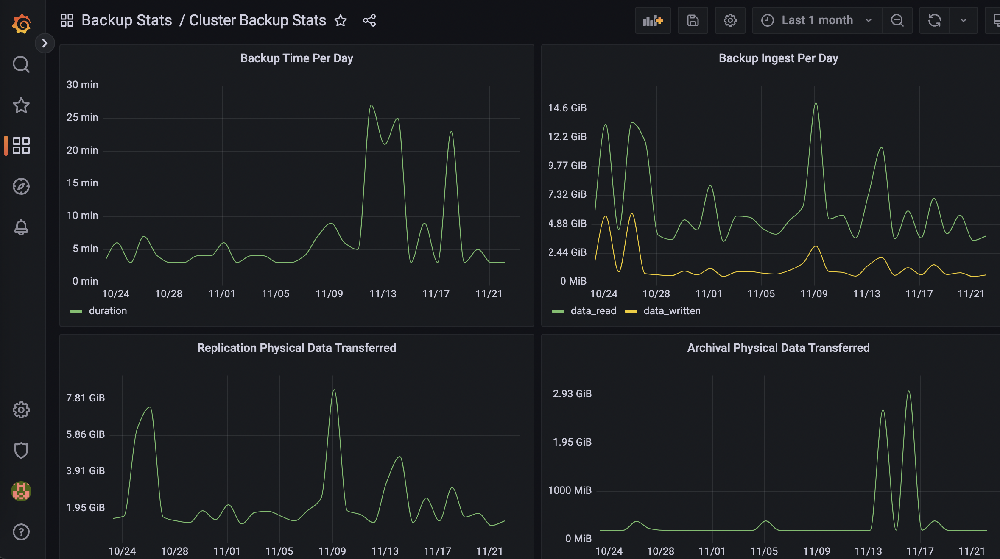

# Cluster Backup Stats Dashboard for Grafana

Warning: this code is provided on a best effort basis and is not in any way officially supported or sanctioned by Cohesity. The code is intentionally kept simple to retain value as example code. The code in this repository is provided as-is and the author accepts no liability for damages resulting from its use.

This Grafana dashboard displays backup performance metrics for a Cohesity cluster.



## Get the JSON File

Go here to get the raw JSON file and save it to your local machine.

<https://raw.githubusercontent.com/cohesity/community-automation-samples/main/reports/grafana/PostgreSQL/ClusterBackupStats/Cluster%20Backup%20Stats.json>

## Create a Grafana Datasource for your Cohesity Cluster

Open the Cohesity UI in your browser and login. Then, change the URL in your address bar to:

<https://mycluster/irisservices/api/v1/public/postgres>

(replacing `mycluster` with the IP or FQDN of your own Cohesity cluster)

You will see JSON output like the following:

```json
[{"nodeId":3120115039050000,"nodeIp":"192.168.1.100","port":27999,"defaultUsername":"reporting_read","defaultPassword":"b29b2f695190d807"},{"nodeId":3120115039060000,"nodeIp":"192.168.1.101","port":27999,"defaultUsername":"reporting_read","defaultPassword":"b29b2f695190d807"}]
```

Take note of the `nodeIp` and `defaultPassword` values. If you see multiple nodes, you only need one nodeIp.

In Grafana, create a PostgreSQL data source with the following settings:

* `Host`: nodeIp:port, for example: 192.168.1.100:27999
* `Database`: postgres
* `User`: reporting_read
* `Password`: defaultPassword, for example b29b2f695190d807
* `TLS/SSL Mode`: disable (unless you have deployed a valid/trusted certificate to your cluster)
* `Version`: 10

## Import the Dashboard

In Grafana, go to Dashboards -> Import and upload the JSON file. Give the new dashboard a unique name and UID, and select our data source.
