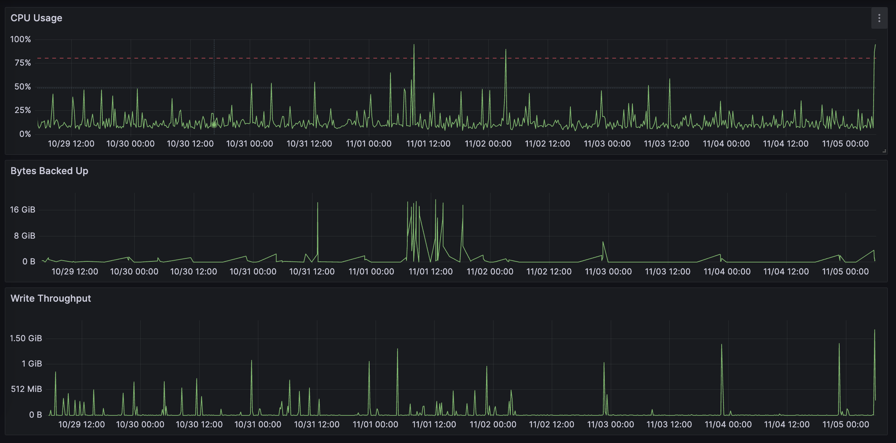

# Prometheus Cluster Stats Dashboard for Grafana

Warning: this code is provided on a best effort basis and is not in any way officially supported or sanctioned by Cohesity. The code is intentionally kept simple to retain value as example code. The code in this repository is provided as-is and the author accepts no liability for damages resulting from its use.

This Grafana dashboard displays backup success rates for a Cohesity cluster.



## Get the JSON File

Go here to get the raw JSON file and save it to your local machine.

<https://raw.githubusercontent.com/cohesity/community-automation-samples/main/reports/grafana/Prometheus/ClusterStats/Cluster-Stats-Prometheus.json>

## Create a Prometheus Data Source in Grafana

Configure the data source to point to your Prometheus instance, e.g. <http://localhost:9090>

## Setup a Prometheus Exporter to Capture Cohesity Cluster Stats

Here is an example Prometheus exporter that gets some time series stats from Cohesity

* [prometheusClusterStatsExporter.py](https://raw.githubusercontent.com/cohesity/community-automation-samples/main/reports/grafana/Prometheus/ClusterStats/prometheusClusterStatsExporter.py)
* [pyhesity.py](https://raw.githubusercontent.com/cohesity/community-automation-samples/main/python/pyhesity.py)

You will also need to install the python module prometheus_client

```bash
pip3 install prometheus_client
```

You can setup the exporter to run as a service:

example: /lib/systemd/system/cohesity-prometheus-exporter.service

```bash
[Unit]
Description=Cohesity Prometheus Exporter Service

[Service]
Type=simple
WorkingDirectory=/usr/local/bin
ExecStart=/bin/bash /usr/local/bin/exporter-start.sh

[Install]
WantedBy=multi-user.target
```

example: /usr/local/bin/exporter-start.sh

```bash
#!/bin/bash
/usr/local/bin/scripts/python/prometheusClusterStatsExporter.py -v mycluster -u myuser 
```

add the exporter to your scrape configs in prometheus.yml

```yaml
  - job_name: "cohesity"
    scrape_interval: 60s
    static_configs:
      - targets: ["localhost:1234"]
```

## Import the Dashboard

In Grafana, go to Dashboards -> Import and upload the JSON file. Give the new dashboard a unique name and UID, and select our data source.
