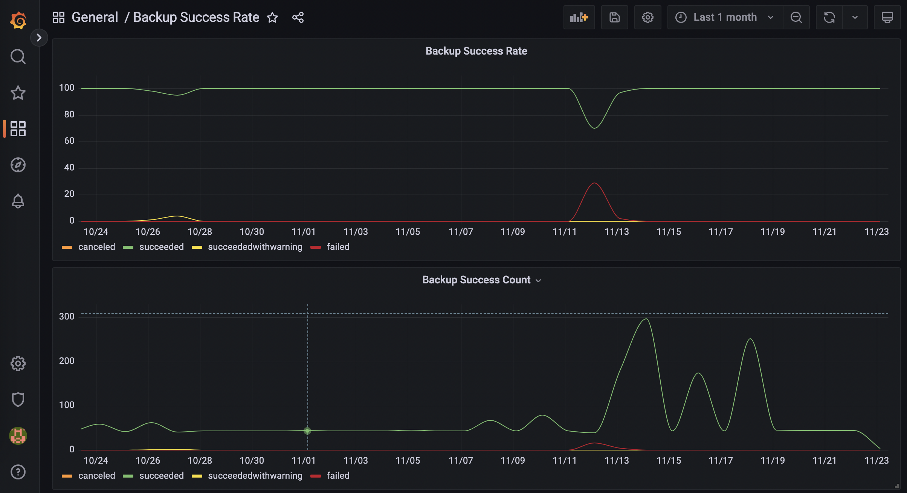

# Grafana Examples

Some Grafana dashboard examples

These examples show various ways to get numerical metrics from Cohesity into Grafana. The two main sources of such metrics are the Cohesity custom reporting database (PostgreSQL) and the Cohesity REST API.

## PostgreSQL Custom Reporting Database

Note: as of Cohesity version 7.x, access to the PostgreSQL database is deprecated. It's still possoble to enable access but requires intervention by Cohesity Support to do so. It is therefore not recommended to use PostgreSQL to access metrics.

## Cohesity REST API

Most metrics are available in the Cohesity UI under System -> Advanced Diagnostics. You can see the API calls used to graph these metrics by watching the developer console of your web browser while exercising the Advanced Diagnostics page.

Once you understand the API calls, you can bring the metrics into Grafana using one of the methods provided here:

### Prometheus Exporter

Prometheus is a time series database that can be used as a data source for Grafana.

Example: <https://github.com/cohesity/community-automation-samples/tree/main/reports/grafana/Prometheus/ClusterStats>

In this example, a Prometheus exporter is configured to retrieve several metrics from Cohesity via the REST API. Prometheus is configured to query the exporter periodically, thus storing a series over time that can be graphed in Grafana.

The exporter code is written in python, and provides examples of how to gather serveral metrics. You can use these examples as a guide to add more metrics.

### InfluxDB

InfluxDB is a time series database that can be used as a data source for Grafana.

Example: <https://github.com/cohesity/community-automation-samples/tree/main/reports/grafana/InfluxDB/ClusterStats>

In this example, an InfluxDB exporter is configured to retrieve several metrics from Cohesity via the REST API and sends data points to InfluxDB every 60 seconds, thus storing a series over time that can be graphed in Grafana.

The exporter code is written in python, and provides examples of how to gather serveral metrics. You can use these examples as a guide to add more metrics.

### JSON-API

The Cohesity REST API can be queried directly using the JSON-API data source type.

Example: <https://github.com/cohesity/community-automation-samples/tree/main/reports/grafana/JSON-API/ClusterStats>

In this example, Grafana queries a web service that in turn queries the Cohesity REST API. The web service returns JSON data that can be graphed in Grafana.

The web service is written in python, and provides examples of how to gather serveral metrics. You can use these examples as a guide to add more metrics.
